# Deep Learning Methods for Higgs Boson Reconstruction

This repository include code for the ttH-ML differential analysis, using data collected by the ATLAS detector at the LHC.

Includes deep learning models produced using primarily Tensorflow and Keras for reconstructing the Higgs momentum spectrum.

## Introduction

Many theories beyond the Standard Model of particle physics predict alterations to the kinematics of the interactions of the Higgs Boson and the Top Quark. This makes differential measurements of Higgs-top interactions (ttH( a promising avenue for searching for new physics. 

For ttH events with multiple leptons in the final state, measuring these kinematics is challenging: Multiple neutrinos which pass right through the detector makes fully reconstructing the Higgs boson impossible, and identify which physics objects in each event originated from the Higgs is challenging.

Deep learning is used to try to overcome these limitations, both for identify the decay products of the Higgs boson and reconstructing its momentum from incomplete information. This repo includes the model generated for this task, and the code used to produce them.

## Models

The trained models can be found [here](results/models/). The [results](results/) directory includes the files necessary for applying the models, and script for adding the predictions of these models to a ROOT file can be found [here](addToRoot/parallelPred_2l.py)

## Overview

This repo includes code for completing the following tasks:

[Truth Matching](truthMatching) - match reco jets, leptons, to their corresponding truth particle, and output a root file with the ID of each truth-matched particles parent. Needed for identifying decay products of tops, Higgs

[B-jet Identification](topMatching) - Build models for identifying which pair of jets includes the b-jets from the top decays. Useful for identifying Higgs decay products.

[Higgs Reconstruction](higgsMatching) - Build models for identifying the decay products of the Higgs

[3l Decay Channel](decay3l) - In the 3l channel, the Higgs can decay into 2 leptons, or 1 lepton and 2 jets. To reconstruct the Higgs, we need to know which of these to look for. These files try to distringuish between these two decay modes

[pT<\sub> Prediction](ptPrediction) - Use the output of the matching algorithms, try to predict the pT of the Higgs

[Background Rejection](sigBkdBDT) - Develop models to distinguish between signal (ttH) events and backgrounds

[Add Results to ROOT files](addToRoot) - Add the results of the various NNs to a ROOT file to be used in the main analysis

[ttW Reconstruction](Wmatching) - Use similar methods to identify which lepton originated fromt the W decay in ttW events

## Results

Here are a few plots summarizing the performance of the models used.

### B-jet Reconstruction - 

In the 2lSS channel, the model identifies the b-jets correctly 74% of the time, and at leasy one correctly 99% of the time. The ROC curve and the output score for the model can be found below:

 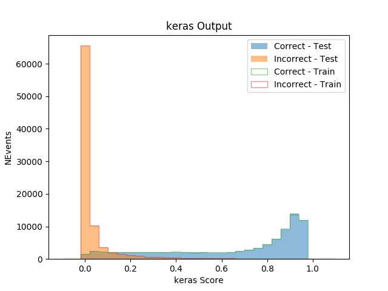

Here are the same plots for the 3l Channel:

 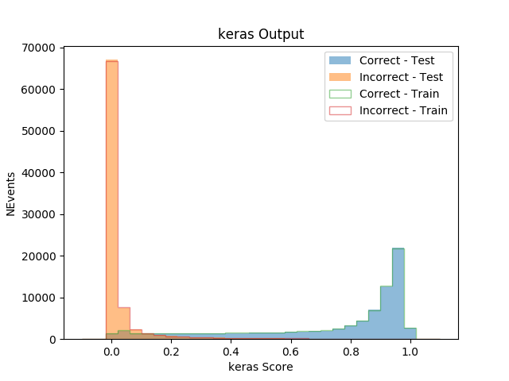

This get the pairing correct 78% of the time.

### Higgs Reconstruction - 

3l Fully leptonic channel:
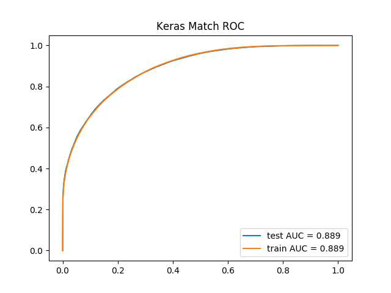 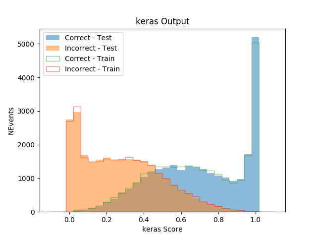

3l Semi-leptonic channel:
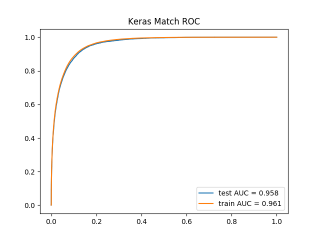 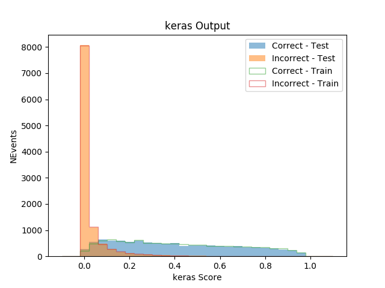

2lSS channel:
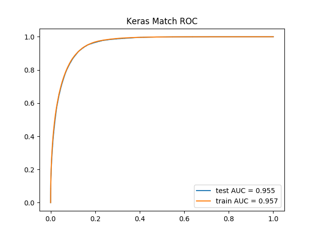 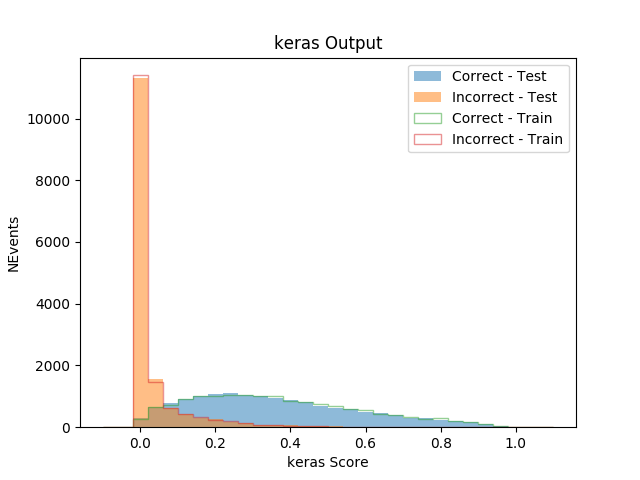

### 3l Decay Channel

A separate model is used in the 3l channel to determine whether the Higgs decayed into two leptons, or one lepton and two jets.

 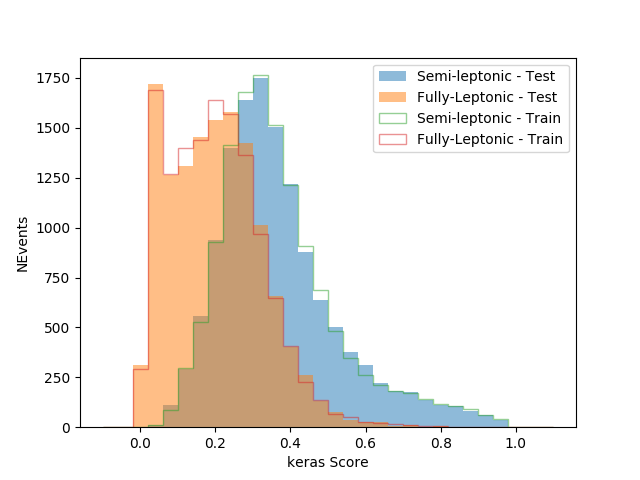

### pT Prediction 

The regressed Higgs Pt is shown below, along with how well the model does at distinguishing high Pt (>150 GeV) and low Pt (<150 GeV) Higgs.

3l Fully Leptonic Channel:
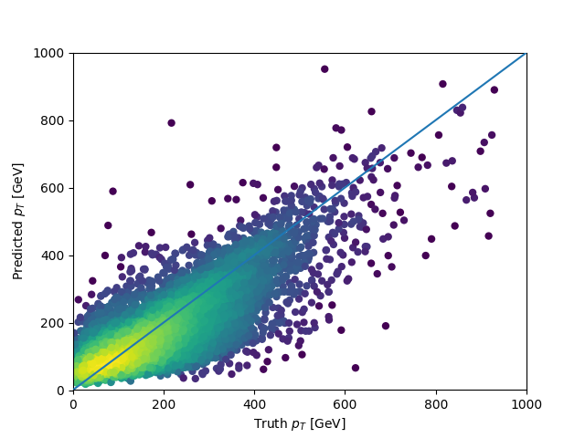 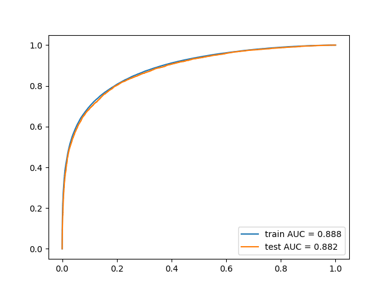

3l Semi-leptonic Channel:
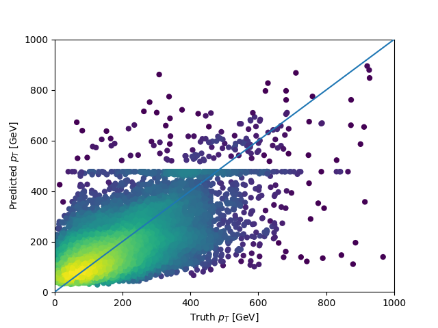 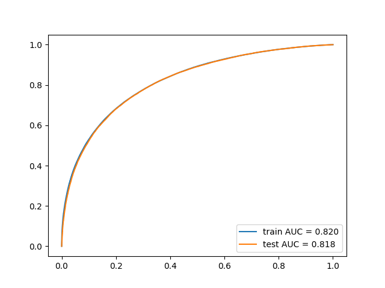

2lSS Channel:
 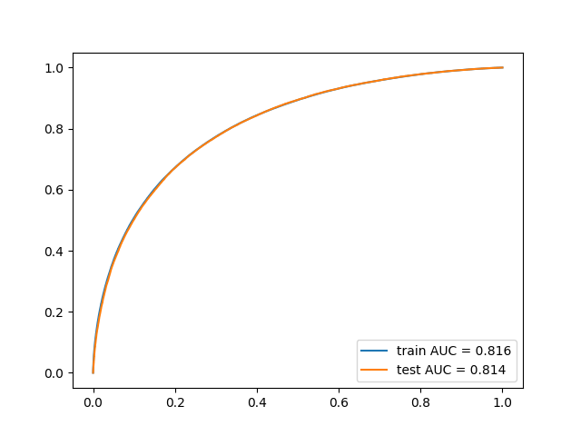

